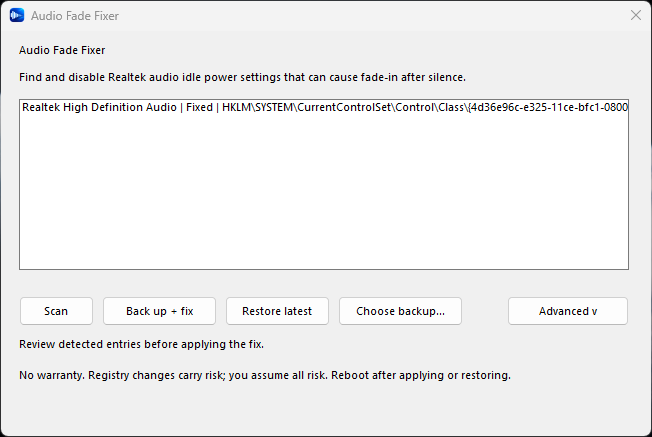

<p align="center">
  
</p>

<h1 align="center">Audio Fade Fixer</h1>

<p align="center">
  A small Windows utility for Realtek audio that fades in after silence.
</p>

<p align="center">
  <a href="https://github.com/shoon/audio-fade-fixer/actions/workflows/ci.yml"></a>
  <a href="https://github.com/shoon/audio-fade-fixer/releases/latest"></a>
  <a href="LICENSE"></a>
  <a href="https://github.com/sponsors/shoon"></a>
</p>

Audio Fade Fixer scans the Windows audio-device registry class for Realtek entries, shows every match, backs up the current values, and applies a community-documented power-management workaround. It handles one or many matching Realtek devices in a single operation.

Nothing is changed during startup or scanning. Windows asks for administrator approval only after you confirm a fix or restore operation.

<p align="center">
  
</p>

## Download

Download the latest portable build from [GitHub Releases](https://github.com/shoon/audio-fade-fixer/releases/latest):

- `audio-fade-fixer-vX.Y.Z-windows-x64.exe` is the standalone application.
- `audio-fade-fixer-vX.Y.Z-windows-x64.zip` also contains the license, notice, and README.
- `SHA256SUMS.txt` contains checksums for both downloads.

No installer is required. The release build supports 64-bit Windows 10 and Windows 11.

The current release is not code signed. Windows SmartScreen may identify it as an unfamiliar application. Verify the SHA-256 checksum before running it, or build the source yourself. Do not run a download whose checksum does not match the release checksum.

## Use

1. Open `audio-fade-fixer.exe`.
2. Review the Realtek entries found by the initial scan.
3. Select **Back up + Fix**.
4. Approve the Windows UAC prompt.
5. Reboot Windows when the operation succeeds.

If every detected entry already contains the fixed values, the app reports that nothing needs to change and does not create a redundant backup.

To undo a change, select **Restore latest** or **Choose backup**, approve the restore details and UAC prompt, then reboot. A restore creates a fresh safety backup of the live values before writing anything.

Open **Advanced** to see the registry paths, old and new values, backup locations, validation results, and operation status.

## What it changes

For each matching Realtek `PowerSettings` key, the application writes these four-byte binary values:

| Registry value | Data |
| --- | --- |
| `ConservationIdleTime` | `FF FF FF FF` |
| `IdlePowerState` | `00 00 00 00` |
| `PerformanceIdleTime` | `FF FF FF FF` |

Targets are restricted to this Windows audio-device class pattern:

```text
HKLM\SYSTEM\CurrentControlSet\Control\Class\
{4d36e96c-e325-11ce-bfc1-08002be10318}\NNNN\PowerSettings
```

The parent driver description must begin with `Realtek`. Bluetooth, HDMI, USB, and unrelated audio devices are not modified.

## Backups

New backups and elevated operation reports are stored under:

```text
%ProgramData%\AudioFadeFixer
```

The application also discovers legacy backups under:

```text
%LOCALAPPDATA%\AudioFadeFixer\backups
```

Keep at least one known-good backup. Driver or Windows updates can recreate registry entries or reset their values, so a later scan may show that the fix needs to be applied again.

## Safety design

Registry edits deserve a narrow security boundary. Audio Fade Fixer:

- runs the GUI without elevation and requests UAC only for a confirmed write;
- rescans under elevation instead of trusting stale GUI results;
- permits only exact Realtek audio-class targets and three fixed value names;
- validates all matching entries before the first write;
- writes a backup before applying the fix and a safety backup before restoring;
- verifies every registry write by reading it back;
- rolls back completed writes if a later write or verification fails;
- stores new backups in a protected ProgramData directory;
- treats user-selected restore files as untrusted input;
- rejects network paths, device paths, reparse points, oversized files, unknown JSON fields, duplicate keys, invalid value lengths, and invalid target paths;
- verifies checksummed backups and binds UAC restore requests to the exact file content approved by the user.

Legacy v0.1 backups remain supported through strict structural validation and are identified in the UI as pre-checksum files. See [SECURITY.md](SECURITY.md) to report a security problem privately.

## Important warning

Editing the Windows Registry can cause system or device problems. This utility is provided **AS IS**, without warranty. You assume all risk. Review the detected paths before proceeding and keep the generated backup.

This workaround may not resolve every audio problem. It is based on a community report, not official guidance from Microsoft, Realtek, HP, or Reddit.

## Build from source

Install the stable Rust toolchain on 64-bit Windows, then run:

```powershell
cargo fmt --all -- --check
cargo test --locked --all-targets
cargo clippy --locked --all-targets -- -D warnings
cargo build --locked --release
```

The executable is written to `target\release\audio-fade-fixer.exe`.

See [CONTRIBUTING.md](CONTRIBUTING.md) before changing registry discovery, backup handling, elevation, or restore validation.

## Support development

Audio Fade Fixer is free and open source. If it helped you, consider [sponsoring @shoon on GitHub](https://github.com/sponsors/shoon). Sponsorship helps cover code signing, test hardware, virtual machines, and the time required to maintain this project and build more practical security-focused utilities.

## Background

The workaround was described in this [r/HPOmen community post](https://www.reddit.com/r/HPOmen/comments/xy6q7w/audio_fading_in_and_out_fix/).

## License

Copyright 2026 Audio Fade Fixer contributors

Licensed under the [Apache License 2.0](LICENSE). The software is distributed on an **AS IS** basis, without warranties or conditions of any kind. See [NOTICE](NOTICE) for attribution and non-affiliation information.
